= Project 3A: Ray Tracing 1 - Rays, Lights & Spheres
:author: Aaron Glick (glick094)
:docdate: 2025-10-24
:description: CSCI 5607 - Computer Graphics 1
:source-highlighter: pygments
:stem: latexmath
:toc: left
:toclevels: 4
:revdate: 2025-10-24
:nofooter:
:sectnum

// Aaron Glick - glick094
CSCI 5607 (Fall 2025)

== Objective

The goal of this project was to create a simple ray-tracer capable of rendering scenes consisting of spheres lit by point light sources. Scenes are described in simple, easy to parse text specification files (which are described in more detail in link:SceneFile.adoc[SceneFile.pdf]). 

== Background Research

I first looked up some interesting and inspiring projects to think through how to design my ray tracer. https://github.com/tcbrindle/raytracer.hpp/tree/master[A compile-time ray tracer] and https://github.com/ssloy/tinyraytracer/tree/master[tinyraytracer] which is written in 256 lines of code, and of course https://raytracing.github.io/books/RayTracingInOneWeekend.html[Ray tracing in one weekend] were the most impactful. 

== Running the Ray Tracer

To compile the ray tracer I used the following. 
[source,bash]
----
g++ -fsanitize=address -fopenmp -O3 -std=c++14 rayTrace_pga.cpp -o ray
----
I compile with the `-O3` optimizer, and use `c++14` I used `-fopenmp` since I parallelized my ray tracer. 

All of the examples can be generated from the following command.

[source,bash]
----
for x in $(find writeup/ShowcaseScenes/ -name "*.txt"); do ./ray "$x"; done
----

== Required Features

=== Camera position

----
camera_pos: x y z
----

The camera position is set by parsing the `camera_pos` field from the scene file and storing it in the eye variable (from `parse_pga.h`),which serves as the origin point for all primary rays cast into the scene.  
// (line 649, 651).

.Varying `camera_pos` with (x, y, z) positions listed
[cols="^1,^1,^1"]
|===
|image:ShowcaseScenes/camera_pos/camera_pos_x0_y0_zn1.png[cameraPosNegZ] + 
`(0,0,-1)`
|image:ShowcaseScenes/camera_pos/camera_pos_x0_y1_z0.png[cameraPosNegY] + 
`(0,-1,0)`
|

|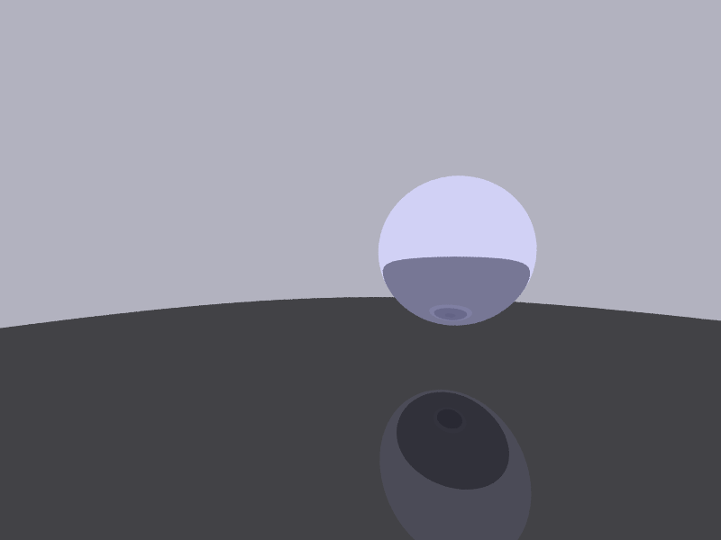 + 
`(-1,0,0)`
|image:ShowcaseScenes/camera_pos/camera_pos_x0_y0_z0.png[cameraPos0] + 
`(0,0,0)`
|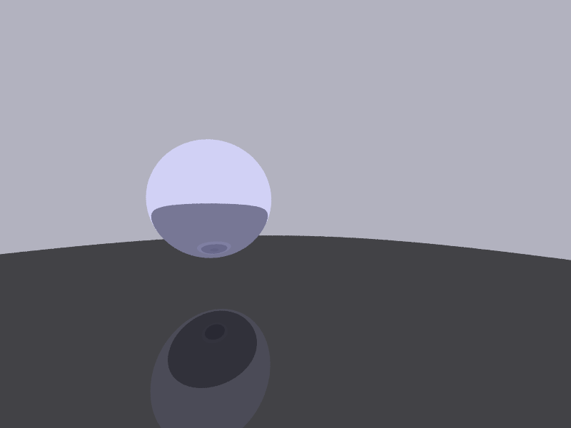 + 
`(1,0,0)`

|
|image:ShowcaseScenes/camera_pos/camera_pos_x0_yn1_z0.png[cameraPosPosY] + 
`(0,1,0)`
|image:ShowcaseScenes/camera_pos/camera_pos_x0_y0_z1.png[cameraPosPosZ] + 
`(0,0,1)`
|===

Clearly, our camera position is working properly. The above were all created with the following camera settings, replacing the specified `camera_pos`. 

----
camera_pos: 0 0 0
camera_fwd: 0 0 -1
camera_up: 0 1 0
camera_fov_ha: 45
----

=== Film resolution

----
film_resolution: width height
----

The film resolution is specified by the `film_resolution` field in the scene file, which sets `img_width` and `img_height` variables used to create the output image buffer and determine the pixel grid dimensions for ray generation.
// (lines 615-616, 619, 628, 634).
This directly deterimines the overall number rays (up to some repeated sample factor) that we need to shoot, since we need to shoot rays for each pixel on our image plane. 

.Varying `film_resolution` with (width, height) positions listed
[cols="^.^1,^.^1"]
|===
|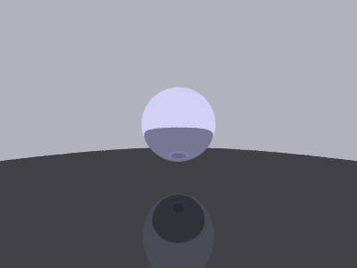 + 
`(400,300)`
|image:ShowcaseScenes/film_resolution/film_resolution_large.png[filmResolutionLarge,800,600] + 
`(1200,900)`
|===

=== Aspect Ratio (FOV)

----
camera_fov_ha: ha
----

The half-angle vertical FOV (`camera_fov_ha`) is used to compute the distance `d` from the eye to the image plane using stem:[d = \angle_\text{HFOV half} / \tan(2 \angle_\text{VFOV half})], which determines how wide or narrow the viewing frustum appears. 
// (line 617).

// | `ha` is one-half of the “height” angle of the viewing frustum. The half-angle of the “width” can be computed from the aspect ratio of the output image (see below). +
// *The default is 45 *

.Varying `camera_fov_ha` with (ha) listed
[cols="^1,^1,^1,^1"]
|===
| + 
`(10)`
|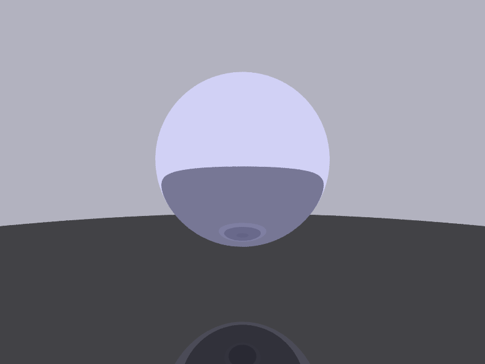 + 
`(30)`
|image:ShowcaseScenes/aspect_ratio/camera_fov_ha60.png[fov60] + 
`(60)`
|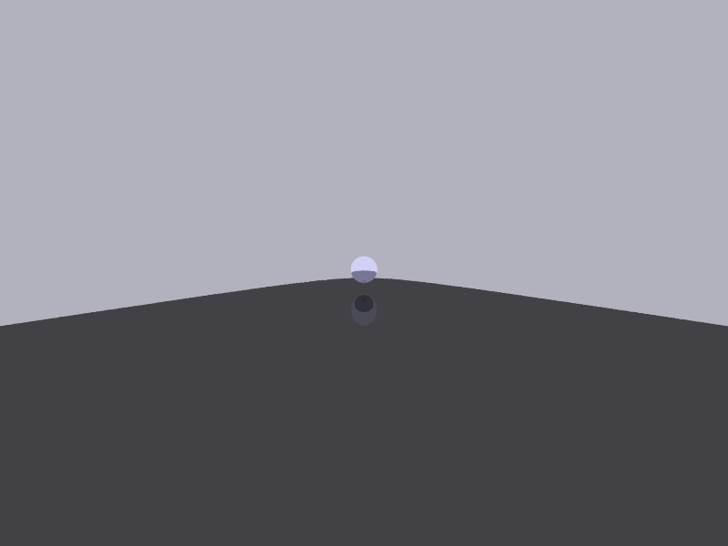 + 
`(80)`
|===

=== Background colors

----
background: r g b
----

When a ray fails to intersect any geometry in the scene, the background color is returned using the RGB values specified by the background field in the scene file. 
// (lines 376-377).

.Varying `background` with (r, g, b) listed
[cols="^1,^1,^1,^1"]
|===
|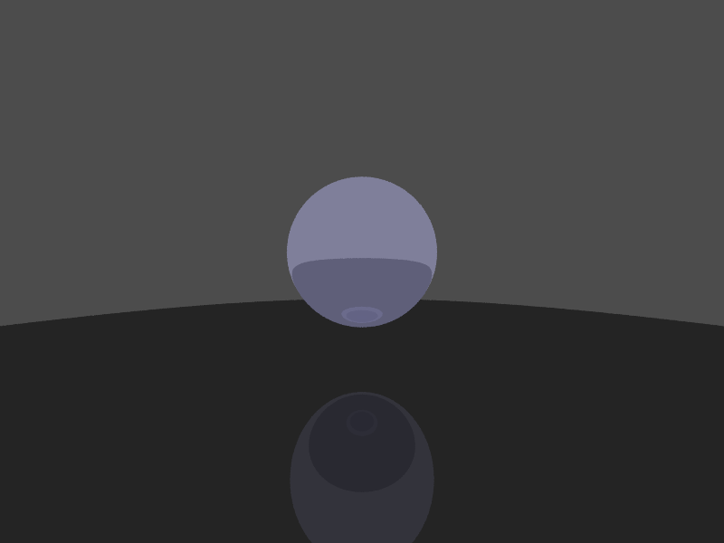 + 
`(0.3,0.3,0.3)`
|image:ShowcaseScenes/background/background_red.png[backgroundRed] + 
`(0.9,0.3,0.3)`
|image:ShowcaseScenes/background/background_green.png[backgroundGreen] + 
`(0.3,0.9,0.3)`
|image:ShowcaseScenes/background/background_blue.png[backgroundBlue] + 
`(0.3,0.3,0.9)`
|===

=== Spheres

----
sphere: x y z r
----

I iterate through all spheres in the spheres vector 
// (lines 322-345) 
and perform ray-sphere intersection tests independently, tracking the closest intersection point to determine which sphere is visible at each pixel.

.Showing multiple `sphere` visualized through provided scenes
[cols="^.^1,^.^1"]
|===
|image:ShowcaseScenes/spheres/spheres1.png[spheres1] + 
`spheres1.txt`
|image:ShowcaseScenes/spheres/spheres2.png[spheres2] + 
`spheres2.txt`
|===

=== Ambient lights

----
ambient_light: r g b
----

The ambient light color (specified by `ambient_light` in the scene file) is multiplied component-wise with each material's ambient coefficients `(ar, ag, ab)` to initialize the base illumination for every surface point, providing constant lighting independent of geometry or light positions. 
// (lines 382-384).

.Varying `ambient_light` with (r, g, b) listed
[cols="^1,^1,^1,^1"]
|===
|image:ShowcaseScenes/ambient_light/ambient_sphere.png[ambientSphere] + 
`ambient_sphere.txt`
|image:ShowcaseScenes/ambient_light/ambient_light_low.png[ambientLow] + 
`(0.2,0.2,0.2)`
|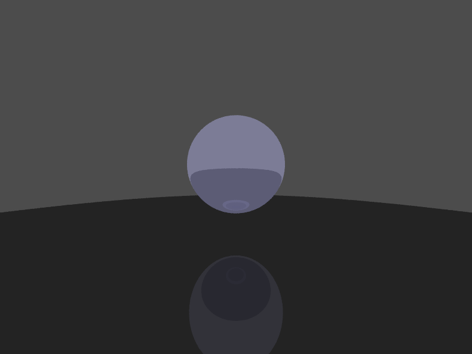 + 
`(0.5,0.5,0.5)`
|image:ShowcaseScenes/ambient_light/ambient_light_high.png[ambientHigh] + 
`(0.8,0.8,0.8)`
|===

=== Point light sources

----
point_light: r g b x y z
----

For each point light I calculate the light's diffuse and specular contributions (with inverse-square attenuation) to the final pixel color. I aggregate this for all lights allowing multiple lights to illuminate the scene simultaneously.

.Varying `point_light` with (r, g, b, x, y, z) listed
[cols="^1,^1,^1"]
|===
|image:ShowcaseScenes/point_light/point_light_single.png[pointLightSingle] + 
`(5,5,5, -1,1,0)`
|image:ShowcaseScenes/point_light/point_light_multiple.png[pointLightMultiple] + 
`(5,5,5, -1.0,1.0,0.0)` +
`(2,2,2,  2.0,0.5,2.8)` +
`(5,5,5,  0.0,3.0,3.0)` 
|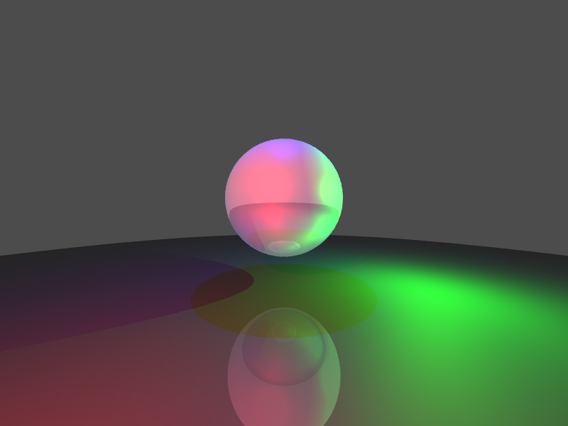 + 
`(5.0,0.1,0.1, -1.0,1.0,0.0)` +
`(0.1,5.0,0.1,  2.0,0.5,2.8)` +
`(0.1,0.1,5.0,  0.0,3.0,3.0)`
|===

=== Basic sampling

I implemented a few different cases of sampling in our ray tracer. The first is that we take a stochastic samples per pixel. I sample 8 times per pixel, and each time we sample from a normal distribution with mean 0 and standard deviation of 0.3. We provide a random offset from the center of the pixel in both the x and y direction (which I clamp to ensure we're in the pixel bounds). 

I've parallelized my ray tracer to make it faster, so I do set a different random seed (I use my favorite, the Mersenne Twister) so that each thread gets it's own random number generation and are seeded differently so we never have race conditions. 

And finally, we take the colors from all 8 samples to be averaged to reduce aliasing. 

=== Color & Specularity 

[source]
----
material: ar ag ab dr dg db sr sg sb ns tr tg tb ior
----

I implemented the Phong lighting model with separate RGB channel calculations for each lighting component, allowing colored lights and materials to interact realistically through multiplicative blending. 
The ambient term multiplies the scene's ambient light color with each material's ambient coefficients `(ar, ag, ab)`, while the diffuse component computes the Lambertian reflectance `(max(0, N·L))` and scales it by both the light's color intensity and the material's diffuse color `(dr, dg, db)`. For specular highlights, 
I use the Blinn-Phong formulation with a half-vector between the light and view directions, raising the clamped dot product `(max(0, N·H))` to the power of the material's shininess exponent `(ns)`, then scaling by the light color and material's specular coefficients `(sr, sg, sb)`. 
All light contributions include inverse-square distance attenuation `(1/d^2)` for physically-based falloff, and  I skip specular highlights on transmissive materials (glass) to avoid double-counting with recursive reflections. 
Shadow rays are cast toward each light source to determine occlusion, ensuring surfaces in shadow receive only ambient lighting.

image:ShowcaseScenes/color_specularity/phong_lighting.png[phong]

[source]
----
# Glass sphere in the center
material: 0.2 0.2 0.2 0.2 0.2 0.2 0.7 0.7 0.7 50 1 1 1 1.3
sphere: 0 0 4 1
# Cyan metallic sphere with high diffuse
material: 0.3 0.3 0.3 0 1 1 0.4 0.4 0.4 80 0 0 0 1
sphere: -0.8 -0.25 3 0.4
# Dark blue sphere diffuse but not transmissive
material: 0.3 0.3 0.6 0.1 0.1 0.6 0 0 0 80 0 0 0 1
sphere: 1.8 -0.25 3 0.4
# Red metallic sphere, low diffuse, small transmissive
material: 0.1 0 0 0.9 0.1 0.1 0.3 0.3 0.3 30 0 0 0 1
sphere: 2 0 7 1.8
# Green sphere behind glass to show refraction
material: 0.0 0.7 0.0 0 1 1 0.4 0.7 0.4 80 0 0 0 1
sphere: 0 0.3 10 0.3
# Yellow mirror sphere, high diffuse and transmissive
material: 0.6 0.6 0 0.6 0.6 0.6 1 1 0.6 100 0 0 0 1 0.9
sphere: -3 2 8 1.5
----

We see clear specular reflections on the yellow mirror sphere and the cyan sphere. 
We see clear diffuse shading on the dark blue sphere. 
We can see the power attenuation through the transmissive components on the glass sphere and the green sphere behind it. 
We see the color blending in the yellow mirror sphere with the red sphere reflection. 

// // Ambient term initialization (lines 382-384):
// // Diffuse term addition (lines 450-454):
// // Specular term addition (lines 462-469):
// [source,cpp]
// ----
// // Ambient term initialization
// float r = ambient_r * hitMaterial.ar;
// float g = ambient_g * hitMaterial.ag;
// float b = ambient_b * hitMaterial.ab;

// // Diffuse term addition:
// float diffuse = fmax(0.0f, dot(normal, lightDir));
// r += attenuation * light.r * hitMaterial.dr * diffuse;
// g += attenuation * light.g * hitMaterial.dg * diffuse;
// b += attenuation * light.b * hitMaterial.db * diffuse;

// // Specular term addition:
// if (hitMaterial.ns > 0 && !isTransmissive) {
// Dir3D viewDir = (rayStart - hitPoint).normalized();
// Dir3D halfVec = (lightDir + viewDir).normalized();
// float specular = pow(fmax(0.0f, dot(normal, halfVec)), hitMaterial.ns);
// r += attenuation * light.r * hitMaterial.sr * specular;
// g += attenuation * light.g * hitMaterial.sg * specular;
// b += attenuation * light.b * hitMaterial.sb * specular;
// }
// ----

// The key point is that you initialize r, g, b with the ambient term, then accumulate diffuse and specular contributions from each light source (lines 387-470) inside the light loop, with attenuation and shadow checks included.

== Selected Features

=== Multiple light sources

As I showed in <<Point light sources>> I am again showing the same images. These show that we can have multiple different light sources in the same scene. Each light can have different colors and the colors mix together nice. 

To do this I simply add a loop for each light `for (size_t li = 0; li < pointLights.size(); li++)` before calculating the diffuse and spectral components of our ray. 

.Varying `point_light` with (r, g, b | x, y, z) listed
[cols="^1,^1,^1"]
|===
|image:ShowcaseScenes/point_light/point_light_single.png[pointLightSingle] + 
`(5,5,5, -1,1,0)`
|image:ShowcaseScenes/point_light/point_light_multiple.png[pointLightMultiple] + 
`(5,5,5, -1.0,1.0,0.0)` +
`(2,2,2,  2.0,0.5,2.8)` +
`(5,5,5,  0.0,3.0,3.0)`
| + 
`(5.0,0.1,0.1, -1.0,1.0,0.0)` +
`(0.1,5.0,0.1,  2.0,0.5,2.8)` +
`(0.1,0.1,5.0,  0.0,3.0,3.0)`
|===

=== Reflection

I implemented recursive ray tracing for reflective surfaces by computing the perfect mirror reflection direction using the formula `R = I - 2(I·N)N`, where `I` is the incident ray direction and `N` is the surface normal. 
// (lines 512, 548, 573). 
The reflected ray is spawned from the hit point with a small offset (0.001 units) along the reflection direction to prevent self-intersection artifacts when the ray re-enters the scene. 
// (lines 513, 549, 574). 
I recursively trace this reflected ray with decremented depth to gather the color of what the surface "sees" in the reflection direction, supporting multiple bounces of light through the scene. 
// (lines 515, 551, 575). 
The resulting reflected color is then blended with the surface's local lighting by multiplying each RGB channel by the material's specular reflection coefficients `(sr, sg, sb)`, allowing colored or tinted reflections like metallic surfaces. 
// (lines 578-580). 
For pure dielectric materials like glass, I use Schlick's approximation of the Fresnel equations to physically blend reflection and refraction based on viewing angle, with grazing angles producing stronger reflections. 
// (lines 503-504, 534-536). 
I also distinguish between metals (pure reflection) and transmissive materials (glass), skipping redundant Phong specular highlights on glass to avoid double-counting the specular component that's already captured in the recursive reflections. 
// (lines 459-462).

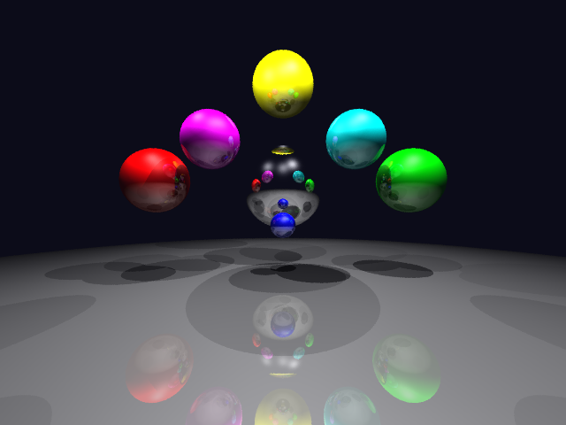

In the image we see a highly reflective mirror ball in the center. 
We are getting a nice reflected image, where all six colored spheres are visible from the warped perspective from reflecting of the mirror sphere. 
I placed the spheres at different angles to the sides, above, and in front of the mirror ball. 
You can even see some of the multiple reflections bouncing between spheres of the reflection itself. 
These, however are limited by our max depth. 

=== Refraction

I implemented refraction for transmissive materials by applying Snell's law to calculate the refracted ray direction, computing the refraction ratio stem:[\eta = n_1 / n_2] and using it to determine the bent ray direction stem:[T = \eta I + N (\eta \cdot \cos{\theta_i} - \cos{\theta_t})].
// (lines 518-524, 558-563, 587-589). 
To handle rays entering and exiting materials correctly, I detect when the incident ray is exiting by checking if the ray direction and surface normal point in the same direction `(dot(n,I) > 0)`, in which case I flip the normal and swap the refractive indices. 
// (lines 484-488). 
I compute the sine squared of the transmission angle stem:[\sin{\theta_t}^2 = \eta^2 (1 - \cos{\theta_i}^2)] 
// (sin²θₜ = η²(1 - cos²θᵢ)) 
to check for total internal reflection, which occurs when this value exceeds 1.0, indicating the ray cannot escape the denser medium; in this case I fall back to using the reflection color instead.
// (lines 518, 528-530, 584). 
The refracted ray is traced recursively with a small offset along the refraction direction to avoid self-intersection, and the returned color is blended with the material's transmission coefficients `(tr, tg, tb)` to allow colored glass effects like tinted windows 
//(lines 525-527, 593-595). 
For pure dielectric materials (glass), I use the Fresnel equations to physically blend reflection and refraction contributions, with the Fresnel factor determining the ratio between reflected and transmitted light based on the angle of incidence.
// (lines 503-536). 
I also implemented some energy conservation for materials with both reflection and refraction by normalizing their contributions when the sum of `sr` and `tr` exceeds 1.0, preventing physically impossible materials that reflect and transmit more light than they receive, but I'm honestly not sure if this is working properly. 
//(lines 541-569).

image:ShowcaseScenes/refraction/refraction_spheres.png[refraction]

Overall, we get the image through the glass sphere being inverted, due to the index of refraction and the focal distance of the objects. 
In the image we see clearly the red sphere being visible through the glass sphere. 
We even get some nice darkening from the shadows on the red sphere in the refracted image of the red sphere. 
You get the internal components of refraction too, bouncing off the opposite (right) side of the sphere as well. 
Off to the far left side we get some green refractions from the green sphere. 
I placed a small blue sphere in front to show it's not being transmitted (I was trying to get a nice reflection in the glass sphere, but couldn't get the lighting quite right). 

== Extra Credit

=== Shadows

To achieve realistic lighting, I implemented hard shadows by casting shadow rays from each surface point toward each light source before computing lighting contributions. For each point light in the scene I determining the light direction and distance, I create a shadow ray starting from the hit point with a small offset slightly along the light direction (0.001 units), which helps avoid false self-intersection artifacts. I then test this shadow ray against all objects in the scene to determine if anything occludes the light source. For individual spheres, I iterate through each sphere and check if the shadow ray intersects it; if an intersection occurs and the distance to that intersection is less than the distance to the light, the point is marked as being in shadow. I perform the same occlusion test for CSG objects, checking unions, intersections, and differences to see if any composite geometry blocks the light path. If any object is found to occlude the light source, the `inShadow` flag is set to `true` and I break out of the intersection loop early for efficiency. 

When a surface point is determined to be in shadow, I skip that light's contribution entirely using a continue statement, meaning no diffuse or specular components are added from that particular light. This means surfaces only receive lighting only from lights they can "see," while still maintaining their ambient component regardless of shadow status. The shadow testing happens independently for each light source, so a surface can be in shadow from one light while still receiving contributions from others, enabling realistic multi-light shadowing effects. 

This approach produces crisp, hard-edged shadows characteristic of point light sources, as seen below.

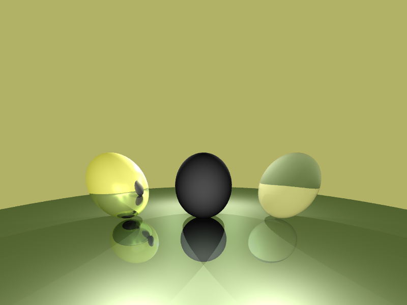

This image is produced by three spheres, one metallic (left), one diffuse but not transmissive (middle), and one dielectric (right) sphere to show the differences in shadows with various materials. 
We have four lights, centered between the spheres, and two in front and two behind. 

[source]
----
# Yellow metallic sphere
material: 0.6 0.6 0 0.6 0.6 0.6 1 1 0.6 100 0 0 0 1 0.9
sphere: -3 0 4 1
# Grey sphere diffuse but not transmissive
material: 0.6 0.6 0.6 0.6 0.6 0.6 0 0 0 60 0 0 0 0.5
sphere: 0 0 4 1
# Glass sphere
material: 0.2 0.2 0.2 0.2 0.2 0.2 0.7 0.7 0.7 50 1 1 1 1.3
sphere: 3 0 4 1
# front lights
point_light: 5 5 5  -1.5 0.5 -1
point_light: 5 5 5   1.5 0.5 -1
# back lights
point_light: 8 8 8   -1.5 1.5 6
point_light: 8 8 8    1.5 1.5 6
----

As we can see we have hard shadow lines, and we see nice overlapping shadows on the center object from the bidirectional lights. 
The transmissive component through our glass should produce a shadow that's overall lighter (since light is transmitting through the glass) than the shadow from our mirror ball (which should not let any light through). However, we can see that these shadows are more or less identical (left most and right most shadows). This is likely because of my `inShadow` flag breaks the loop. I likely need to consider the transmissivity of the sphere, instead of assuming all the objects completely block the shadows. 
I also see a problem with our front lights (that are behind the camera) not casting visible shadows backwards. 
Was able to get these in other images (see <<Reflection>>, <<Refraction>>, <<Art Contest>>), but for what ever reason there might be an edge case where the lights are not bright enough or hitting a condition since they are fairly close to the camera point. 

=== Difference/Intersection (CSG)

I was able to implement constructive solid geometry (CSG) union, difference, and intersection operators. 

Below, in the left image we have two spheres in red are joined with a union. The two spheres in green are joined with an intersection, so we see a lens shaped shape (kinda like a lentil). The two spheres in blue are joined with a difference, so we see a sphere with a divot. 

.Showcasing `csg_union`, `csg_intersection`, `csg_difference`
[cols="^1,^1,^1"]
|===
|image:ShowcaseScenes/constructive_solid_geometry/csg_operations_basic.png[csgOperationsBasic] + 
`csg_union` + 
`csg_intersection` + 
`csg_difference`
|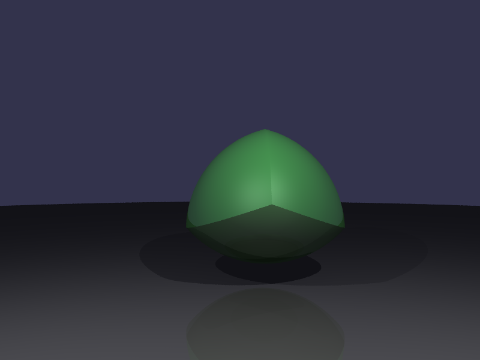 + 
`intersection with three spheres` + 
`(sphere: 0 0 8 2.1)` +
`(sphere: 1 0 8 2.1)` +
`(sphere: 0.5 1.414 8 2.1)` +
`(csg_intersection: 1 2 3)` 
|image:ShowcaseScenes/constructive_solid_geometry/csg_operations_multiple_difference.png[csgOperationsMultipleDifference] + 
`difference with three spheres` + 
`(sphere: 0.3 1 4.9 1.0)` + 
`(sphere: 0.3 1 5.5 1.0)` + 
`(sphere: 0.3 1 6.1 1.0)` + 
`(csg_difference: 2 1 3)`
|===

I then implemented CSG to have multiple spheres joined. The second image above we can see multiple spheres 
The third image above we see we can create rings by taking the difference of three sphere. I've added a second ring just to show the side and insides of the difference operator. 

== Comparison to provided SphereExamples

I figured I should do a side by side comparison of the examples provided, to look at places to improve my implementation. 

[cols="^1,^1,1"]
|===
| Provided Example | My Rendering | Observations

| 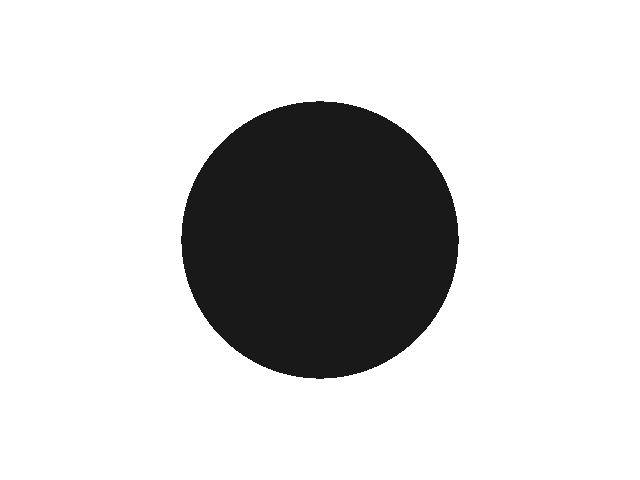
| 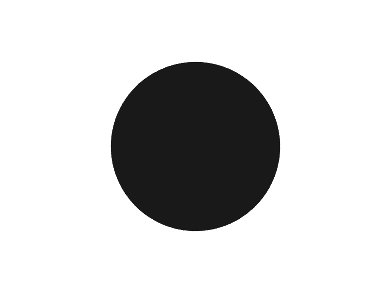 
| Looks like my image may be a little less jaggy around the edges
| 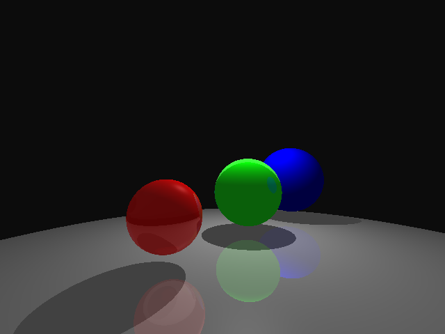
| 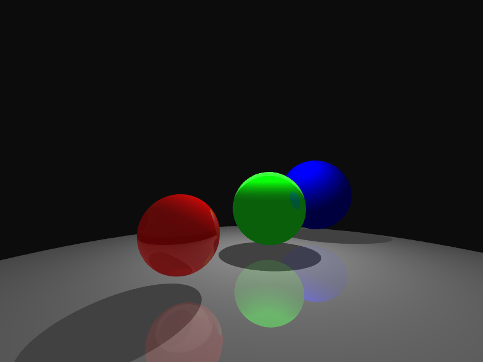 
| Overall, very close. My implementation maybe looks a little less vibrant, and something is happening with the spectral lighting on the green sphere
| 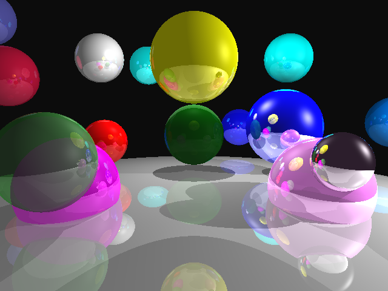
| image:ShowcaseScenes/example_comparisons/spheres2_AG.png[spheres2AG]
| More clear that something weird is happening with the lighting. Less spectral lights on the yellow, and more on the dark blue (larger white circle). The mirror ball looks less reflective.  
| 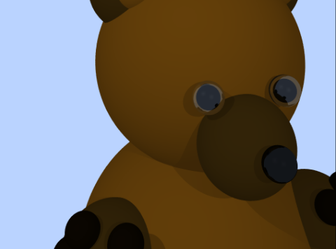
| 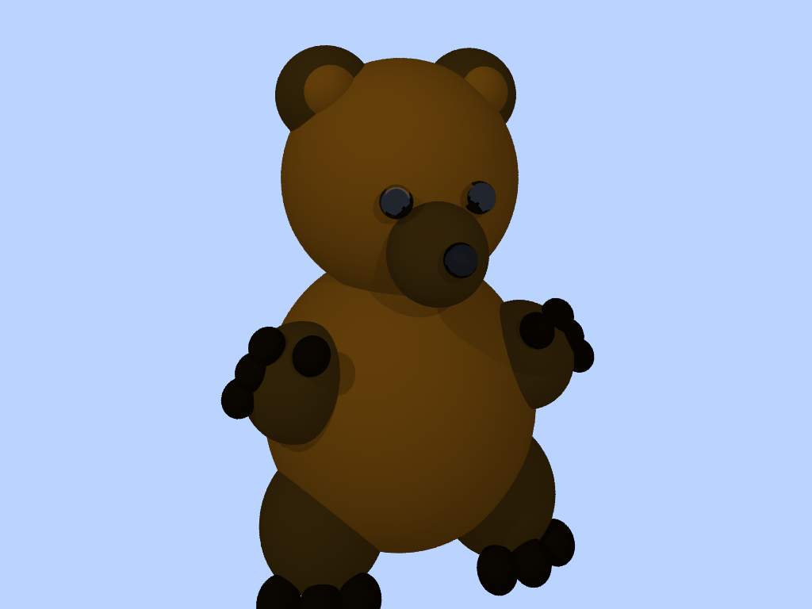
| Again, the eyes are pretty clearly different. Still a glassy effect, but less hightlight reflections in my bear. 
// | 
// | 
|===

== Art Contest

I was thinking of things that I wanted to create with just spheres, and I got the idea of doing a pokéball. I spent a lot more time getting this right, and in the end it helped me set specific thresholds for metallic materials, and reflections. 

So each pokéball is created from 5 main components (1) the top red part, created with a CSG difference of three spheres; (2) the bottom white part, created with a CSG difference of three spheres; (3) the interior black part, created with a single sphere; (4) a round rim of the button, created with a CSG difference of three spheres; and (5) a rounded button face, created with a CSG intersection of two spheres. 

Here's the exploded view: 
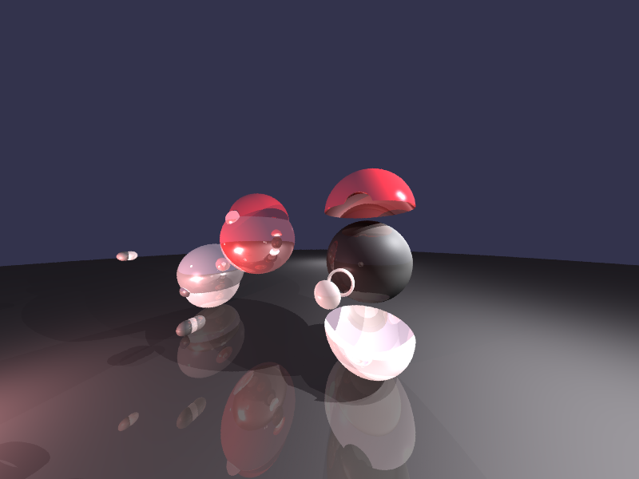

You can see the red part has three spheres (the darkest is the first sphere, the lighter two are the ones that are subtracted). The first subtraction creates the "semi-sphere" that has a concave portion on the inside. The second subtraction creates the circular cutout on the front of the pokeball. 

The red and white parts of the pokeball are constructed exactly the same, just inverted. Then the button band (outer ring) is constructed with three spheres (shown directly below the expanded white part), where the white part remains. Finally, the button face is created with the intersection of two spheres (shown float on the far left side of the screen). 

.Art Submission
image:ShowcaseScenes/art_contest/pokeball.png[pokeball, 1200, 900]

To create my submission, I followed the building procedure described above to create one pokeball. I then created two copies, and put them on a diagonal along `z` (to show nice shadows). To create the open pokeball, I needed to do two additional differences to create two halves of the interior black sphere. I then threw in a point light inside the ball to create the red glow, as if there's something inside. I added four point lights in the environment to create some interesting lighting. 

== Access source code

You can access the source code here: https://drive.google.com/file/d/1S-Kxt4JVoTKRTEvjADSvf26lNrgBYpv7/view?usp=sharing, which was compiled on a linux machine. 